# 作业说明

所有作业源代码均在**homework**文件夹下，共七次作业。通过点击**app**主界面上的作业序号按钮，可查看对应作业的实现效果。

<table>
  <tr>
    <td>app主页面</td>
  </tr>
  <tr>
    <td>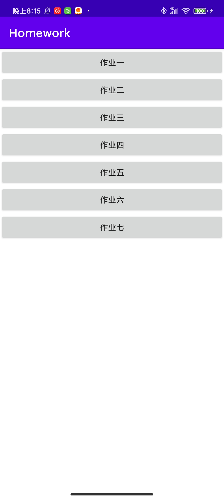</td>
  </tr>
 </table>

# 作业一

- 作业要求：实现一个题库应用，包含题目的列表和对应题目的详细信息。
- 主要技术：`Scrollview`和`textview`的使用
- 实现成果：总共拥有10道题目，可以点击跳转到对应题目的详细结果。
- 成果展示：

<table>
  <tr>
    <td>主页面</td>
     <td>滑动主页面</td>
  </tr>
  <tr>
    <td>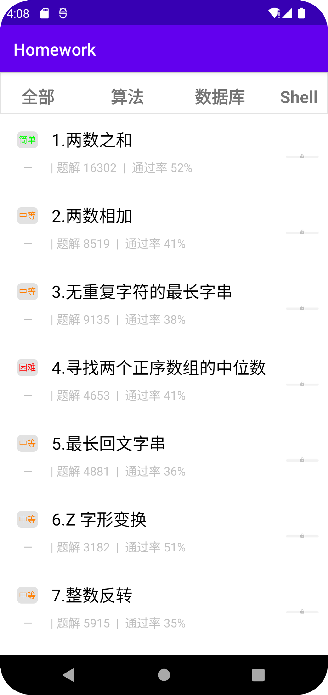</td>
    <td>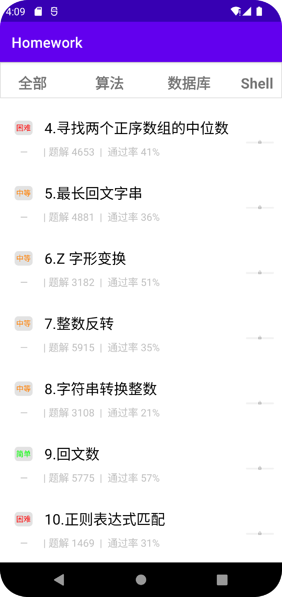</td>
  </tr>
 </table>

<table>
  <tr>
    <td>题目1</td></td>
     <td>题目10</td>
  </tr>
  <tr>
    <td>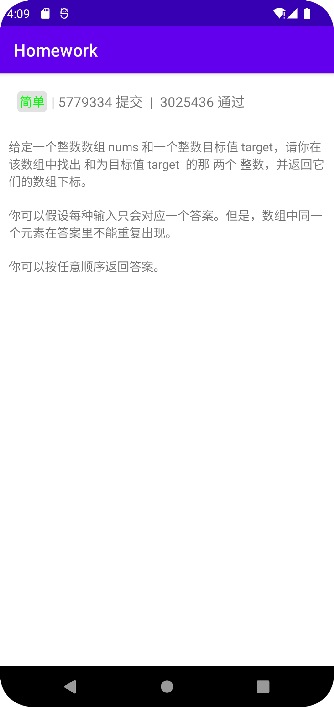</td>
    <td>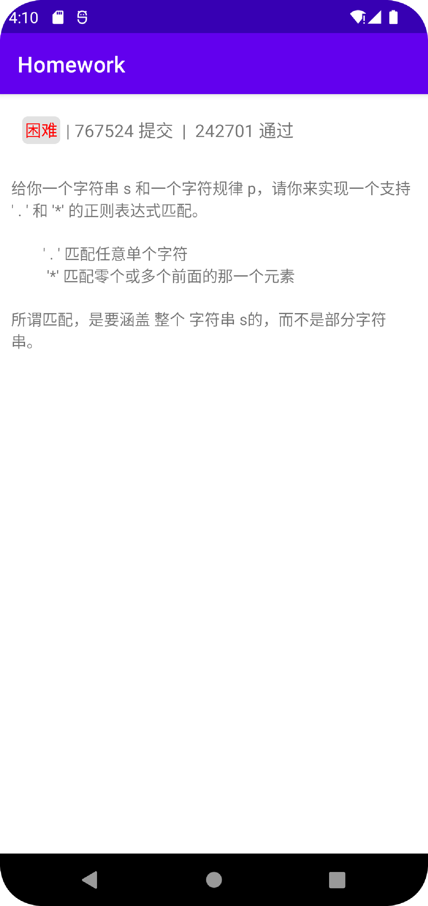</td>
  </tr>
 </table>

# 作业二

- 作业要求：实现一个一键三连的效果
- 实现技术：`ObjectAnimator`和`AnimatorSet`的使用。
- 实现成果：点击点赞，可以出现一键三连的效果，然后恢复原始状态；点击踩、投币、收藏，这几个图标会变红，再次点击，又会变成灰色；点击返回，会回到主界面。

- 成果展示：

  <table>
    <tr>
      <td>主界面</td></td>
       <td>一键三连页面</td>
   <td>动图效果</td>
    </tr>
    <tr>
      <td>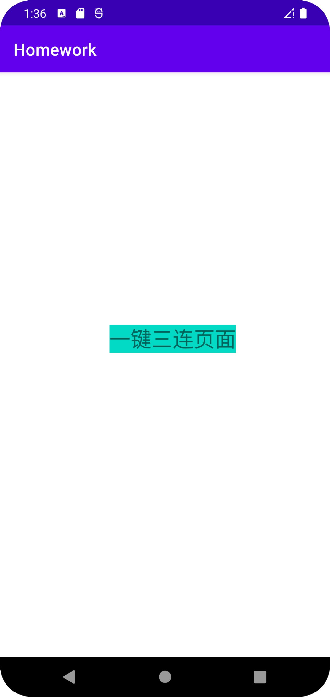</td>
      <td>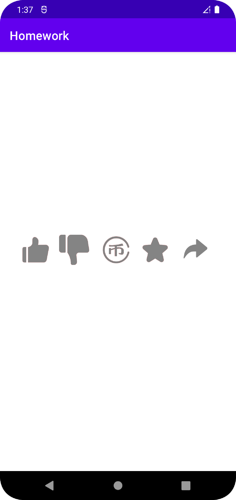</td>
        <td></td>
    </tr>
   </table>

# 作业三

- 作业要求：实现一个时钟动画
- 实现技术：自定义View
- 实现成果：1. 实现表盘界面，指针可以随时间跳动；2. 实现数字时间显示。
- 效果展示：

<table>
  <tr>
    <td>时钟界面</td></td></tr>
  <tr>
    <td>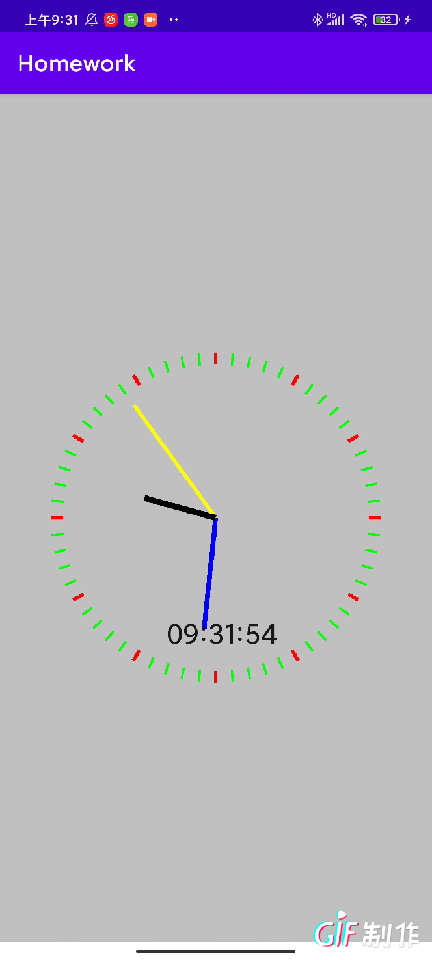</td></tr>
 </table>

# 作业四

- 作业要求：实现一个简单的翻译App
- 实现技术：`okhttp` 网络技术
- 实现成果：1. 可以对输入的单词进行翻译，获取翻译结果；2. 可以最多存储10条搜索记录； 3. **WireSharkCapture** 文件夹下有DNS和TCP，TLS的抓包。
- 效果展示：

<table>
  <tr>
<td>主搜索页面</td>
 <td>显示翻译结果页面</td>
       <td>动态展示</td>
  </tr>
  <tr>
    <td>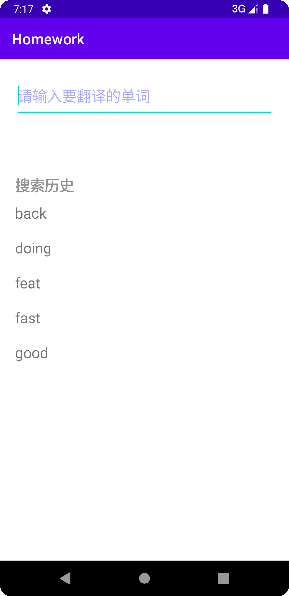</td>
       <td>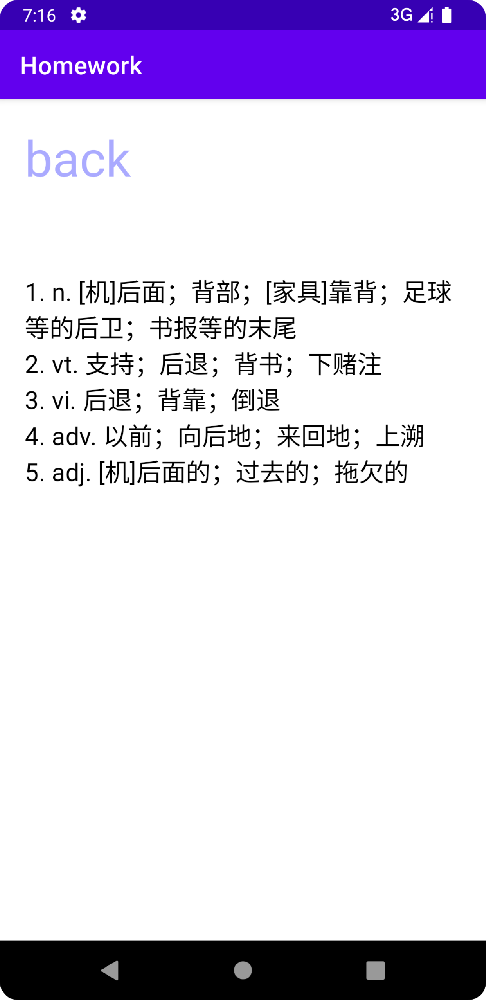</td>
      <td>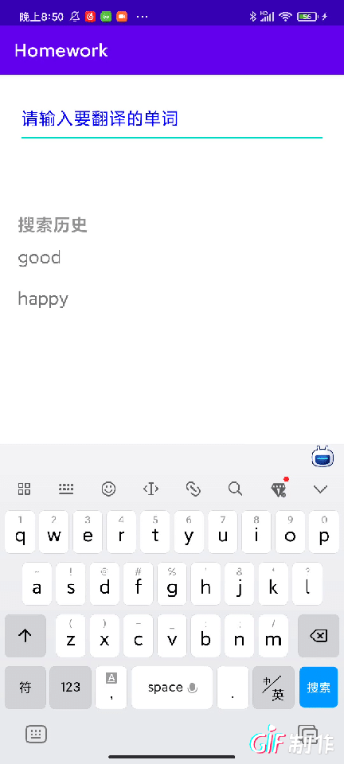</td>
    </tr>
</table>

# 作业五

- 作业要求：完成一个todolist的记事本。
- 实现技术：数据库存储，`Activity`广播，`recycleView`单个item点击事件
- 实现成果：1. 有任务列表界面（主界面），记录了所有的任务；2. 有任务添加界面，可以添加任务，主要包括任务的名称，细节，开始时间和结束时间；3. 对出现某个输入为空的情况和开始时间大于结束时间的情况发出警告。4. 点击删除图标可以进行删除操作；5. 点击修改图标可以进行修改操作。
- 成果展示：

<table>
  <tr>
<td>任务列表页面</td>
 <td>添加任务页面</td>
  </tr>
  <tr>
    <td>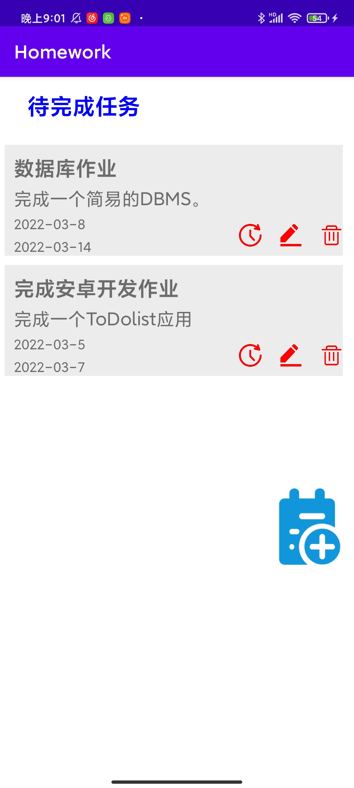</td>
       <td>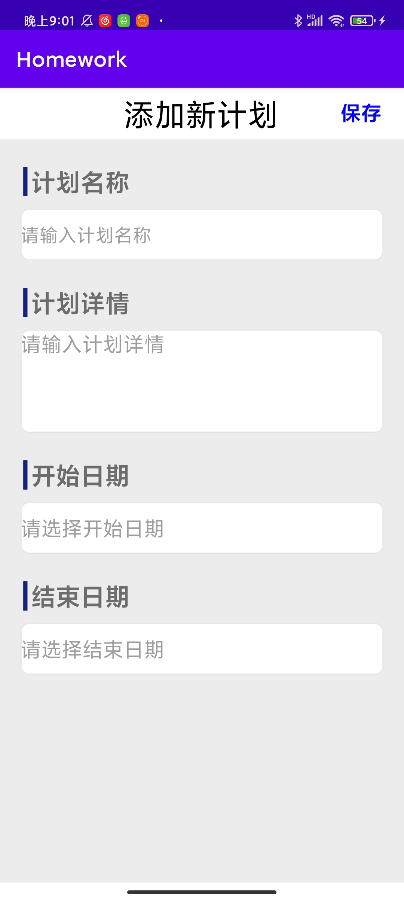</td>
    </tr>
</table>
<table>
  <tr>
<td>添加操作</td>
 <td>删除和修改操作</td>
  </tr>
  <tr>
    <td></td>
       <td>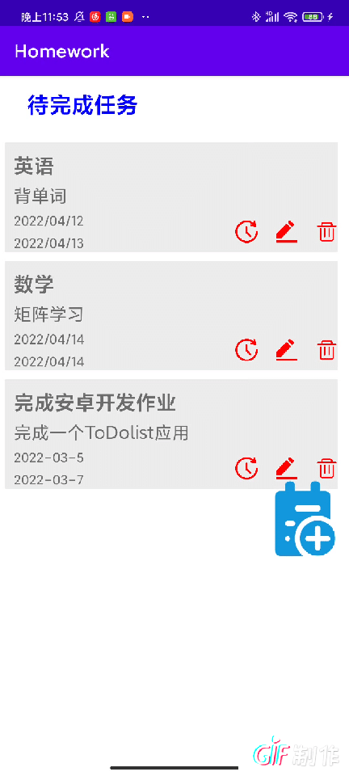</td>
    </tr>
</table>

# 作业六

- 作业要求：可以进行网络图片展示和视频播放。
- 实现技术：`glide`库和`VideoView`控件。
- 实现成果：1. 可以进行静态和动态图片的展示和翻页；2. 可以进行视频的播放，暂停，进度条的拖拽和横竖屏的切换。
- 效果展示：

<table>
  <tr>
<td>主页面</td>
 <td>图片展示页面</td>
   <td>视频展示页面</td>
  </tr>
  <tr>
    <td>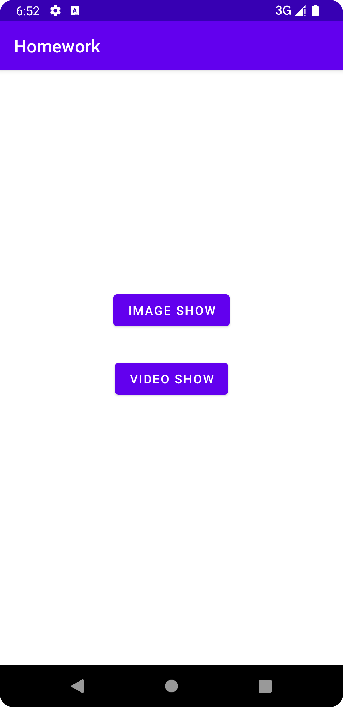</td>
       <td>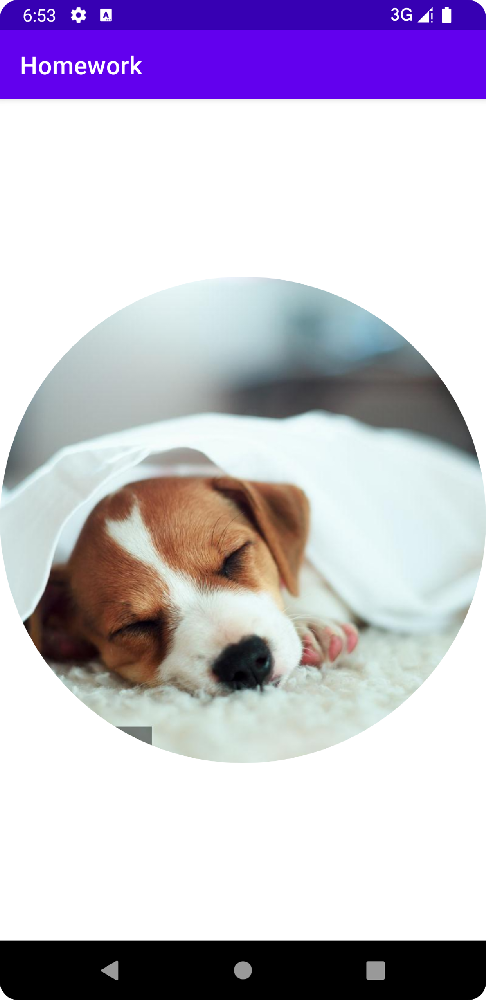</td>
      <td>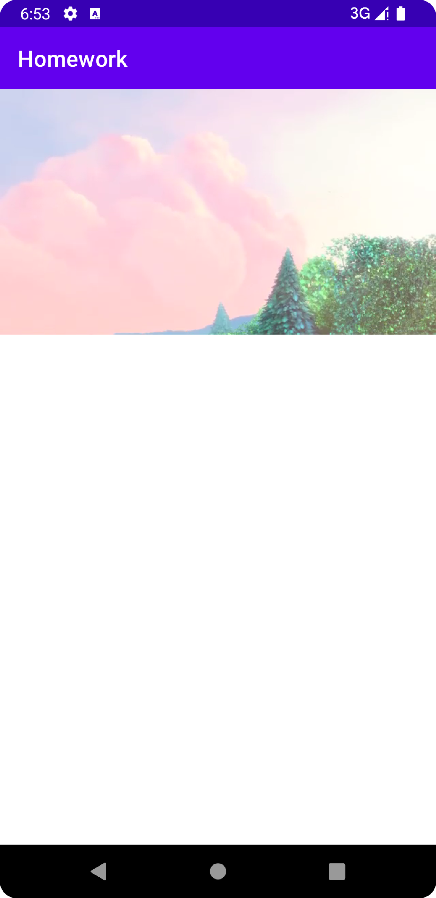</td>
    </tr>
</table>

<table>
  <tr>
 <td>图片滑动展示</td>
   <td>视频播放展示</td>
  </tr>
  <tr>
    <td></td>
       <td></td>
    </tr>
</table

# 作业七

- 作业要求：进行自定义图片拍摄和视频拍摄。
- 实现技术：`surfaceView`和调用camera
- 实现成果：实现了视频和图片的拍摄

- 成果展示

<table>
  <tr>
 <td>拍摄展示</td>
  </tr>
  <tr>
    <td></td>
    </tr>
</table

