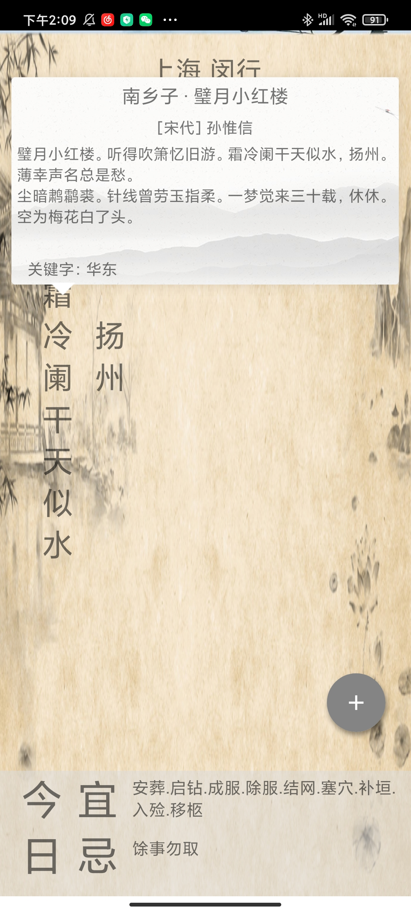

助手君

#简介

**助手君**是一个比较用诗意的工具app，主要包含几个小工具，以方便个人在学校寝室的生活。

# 功能

- 查看天气预报：可以查看实时天气和未来天气，并根据天气推荐诗句

<table>
  <tr>
    <td>天气页面1</td>
      <td>天气页面2</td>
      <td>天气页面3</td>
  </tr>
  <tr>
    <td></td>
       <td></td>
       <td></td>
  </tr>
 </table>

- 简单记账：可以记录本月的支出和收入，统计不同类型的收入和支出的占比。

<table>
  <tr>
    <td>记账显示页面1</td>
      <td>记账显示页面2</td>
      <td>记账显示页面3</td>
  </tr>
  <tr>
    <td></td>
       <td></td>
       <td></td>
  </tr>
 </table>

<table>
  <tr>
    <td>记账添加页面1</td>
      <td>记账添加页面2</td>
      <td>记账添加页面3</td>
  </tr>
  <tr>
    <td></td>
       <td></td>
       <td></td>
  </tr>
 </table>

- 浴室使用信息查询：可以查询学校宿舍楼栋的浴室使用情况，便于避开人多的时间。

<table>
  <tr>
    <td>浴室显示页面1</td>
      <td>浴室显示页面2</td>
  </tr>
  <tr>
    <td></td>
       <td></td>
  </tr>
 </table>

# 主要技术

- api调用和数据接收
- 数据库存储
- UI动画制作
- 图片加载技术
- fragment和activity交互
- 列表刷新技术

# 参考

[安卓智能刷新框架](https://keenprogram.com/Post/View/e99d40e8c04c9c55626a4395d24ce9af)

[诗语天气](https://github.com/hzm0321/PoetryWeather)

[XUI安卓框架](https://github.com/xuexiangjys/XUI)

[naivegator](https://github.com/Purewhite2019/naivegator)

# 使用的api

https://plus.sjtu.edu.cn/api/sjtu/bathroom

https://console.qweather.com/?#/apps

https://www.juhe.cn/docs/api/id/65

https://www.jinrishici.com/doc/

https://lbs.amap.com/

https://www.seniverse.com/

注：部分api可能失效

